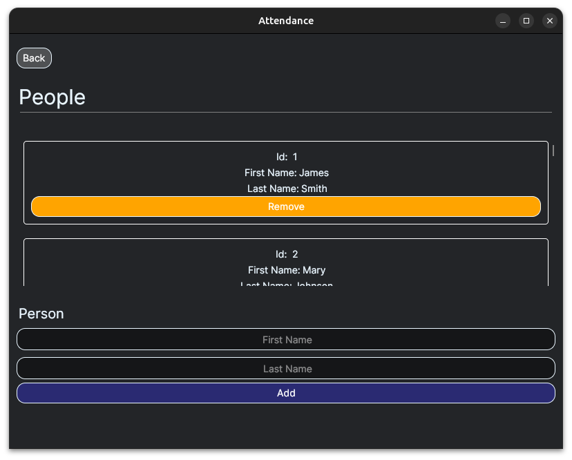
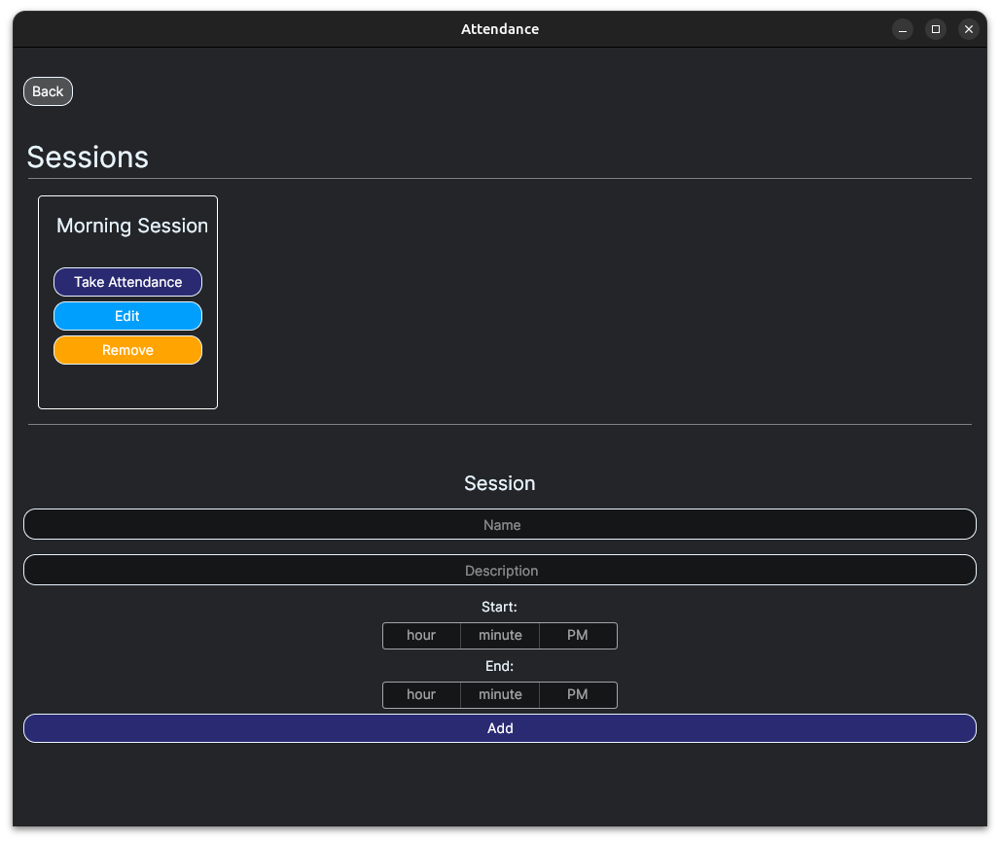
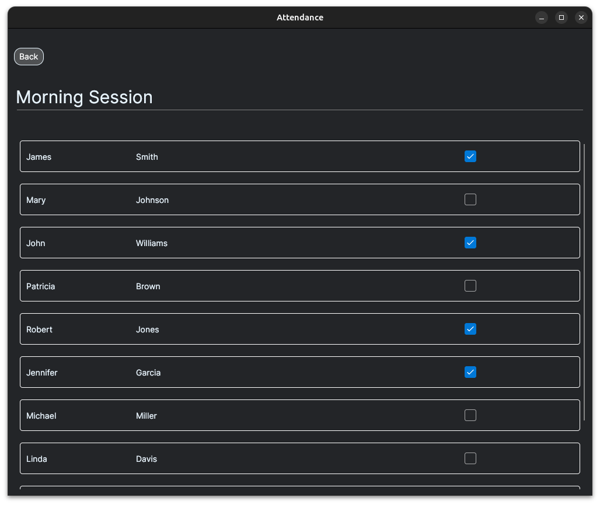

    <h1>Attendance</h1>

### An Attendance tracker being built in C# using Avalonia UI.

## Manage Attendance Using Groups and People.

### Add and remove people from groups.

### Add and remove people from the database.

## Sessions
### Sessions refer to an event that you would to track attendance for.

## Attendance Register
### Mark people present for particular Sessions.

